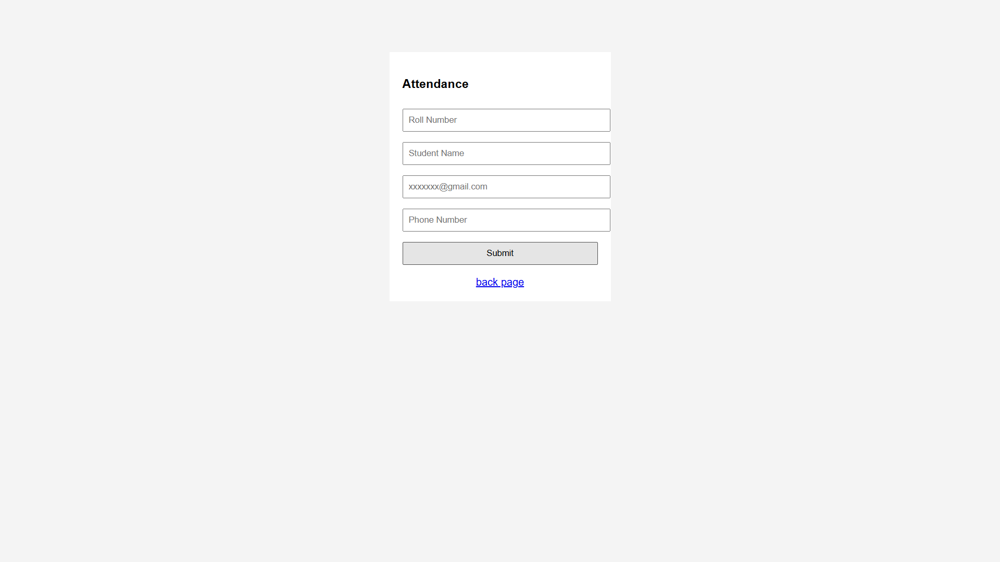

# Attendance Management System

This is a web-based Attendance Management System built with Python, Flask, and PostgreSQL.

## Features

- **Student Management:** Add new students to the system.
- **Attendance Tracking:** Simple check-in and check-out functionality.

## Images

### Add Student


### Attendance


## Prerequisites

- Python 3.x
- PostgreSQL

## Installation

1. Clone this repository.
2. Install dependencies:
   ```bash
   pip install -r requirements.txt
   ```
3. Set up the PostgreSQL database using the provided `schema.sql`.
4. Configure the database connection settings in `app.py`.
5. Run the application:
   ```bash
   python app.py
   ```
